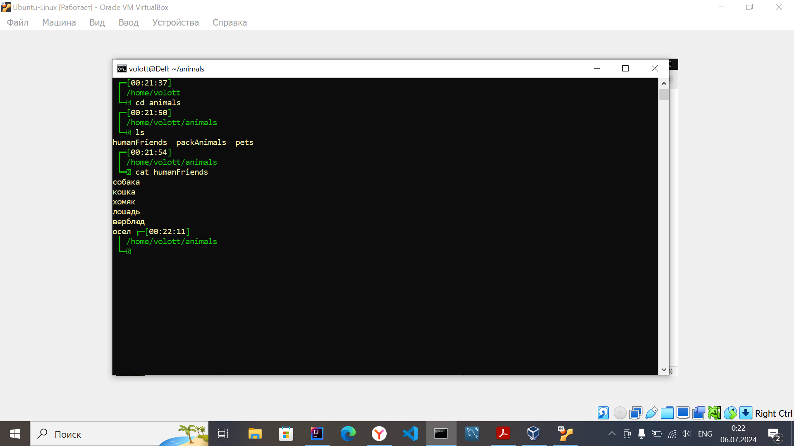

# Решение
### Задание 1

  Используя команду cat в терминале операционной системы Linux, создать
   два файла Домашние животные (заполнив файл собаками, кошками,
   хомяками) и Вьючные животными заполнив файл Лошадьми, верблюдами и
   ослы), а затем объединить их. Просмотреть содержимое созданного файла.
   Переименовать файл, дав ему новое имя (Друзья человека).

mkdir animals

cd animals

cat > pets

_вводим в терминале: собака кошка хомяк , жмём Ctrl+D_

cat > packAnimals

_вводим в терминале: лошадь верблюд осел , жмём Ctrl+D_

cat pets packAnimals > allAnimals

cat allAnimals

mv allAnimals humanFriends

### Задание 2

Создать директорию, переместить файл туда.

mkdir animals2

mv humanFriends /home/volott/animals/animals2/

### Задание 3

Подключить дополнительный репозиторий MySQL. Установить любой пакет
   из этого репозитория.

_Скачиваем пакет настройки репозитория по ссылке ниже:_

https://dev.mysql.com/downloads/file/?id=531268

cd Загрузки

sudo dpkg -i mysql-apt-config_0.8.32-1_all.deb

sudo apt update

sudo apt install mysql-server

systemctl status mysql

### Задание 4

Установить и удалить deb-пакет с помощью dpkg.

_Находим необходимый нам пакет или драйвер в интернете, например на сайте
launchpad.net и скачиваем его_

cd Загрузки

_копируем имя скаченного пакета_

sudo dpkg -i _вставляем имя_

_устанавливается пакет_

sudo apt -f install _если пакет установился с ошибками_

_для удаления пакета, находим его в списке установленных_

sudo dpkg -l | grep  _слово из имени установленного пакета,
что бы отсеить не нужные_

_копируем имя установленного пакета из списка установленных_

sudo dpkg -r имя пакета

sudo dpkg --purge имя пакета , _удалим также конфигурационные файлы_

### Задание 7

В подключенном MySQL репозитории создать базу данных “Друзья
   человека”

CREATE DATABASE IF NOT EXISTS HumanFriends;

USE HumanFriends;

### Задание 8

Создать таблицы с иерархией из диаграммы в БД

[<u>переход к диаграмме</u>](img/diagram%20(2).png)

### Задания:

9. Заполнить низкоуровневые таблицы именами(животных), командами
   которые они выполняют и датами рождения
10. Удалив из таблицы верблюдов, т.к. верблюдов решили перевезти в другой
    питомник на зимовку. Объединить таблицы лошади, и ослы в одну таблицу.
    11.Создать новую таблицу “молодые животные” в которую попадут все
    животные старше 1 года, но младше 3 лет и в отдельном столбце с точностью
    до месяца подсчитать возраст животных в новой таблице
12. Объединить все таблицы в одну, при этом сохраняя поля, указывающие на
    прошлую принадлежность к старым таблицам.

### можно просмотреть по ссылке:

[<u>Ссылка на SQL файл</u>](HumanFriends.sql)

